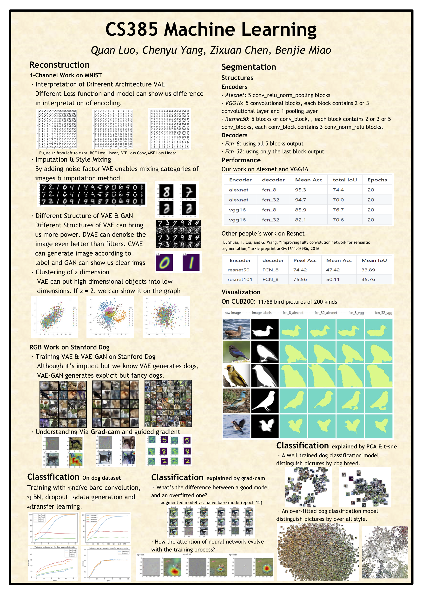

# CS385ML
SJTU CS385 Machine Learning Final Project. Including four parts that are mainly concerned in Machine Learning field namely classification, reconstruction, image segmentation and explanation to those networks and their performances.

All the codes and performance are stored in the responding folders. The tips to run codes are included by the README.md in each folders. Project2.pdf is all our requirement for this course. 

We also make a poster and lectured it to class. I'm in charge of the reconstruction part which mainly focus on VAE.

