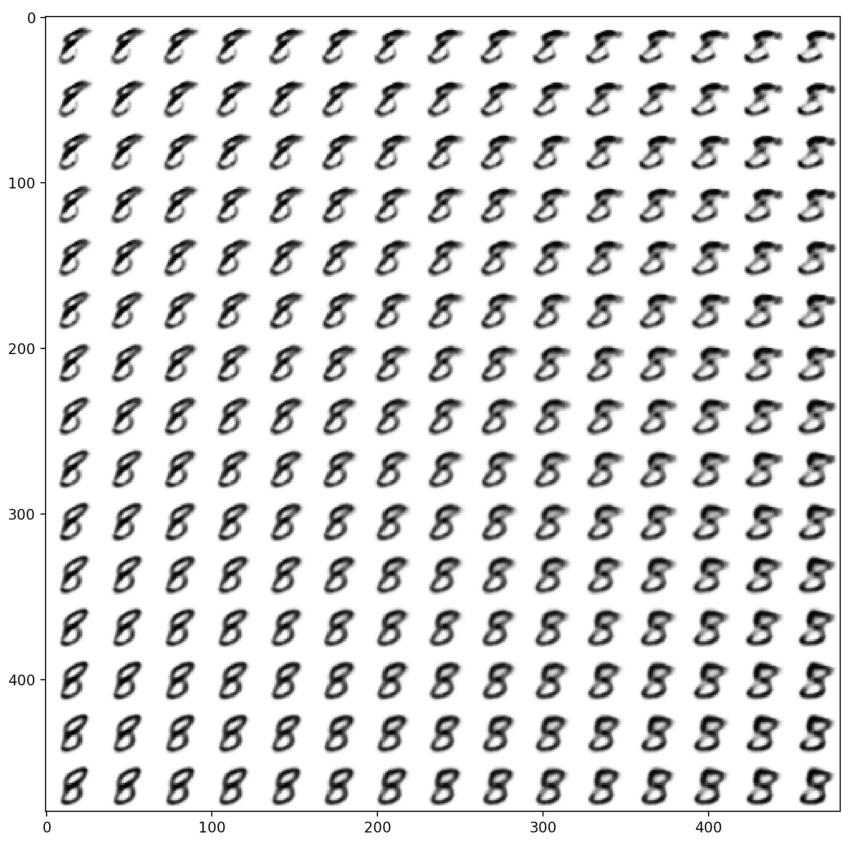
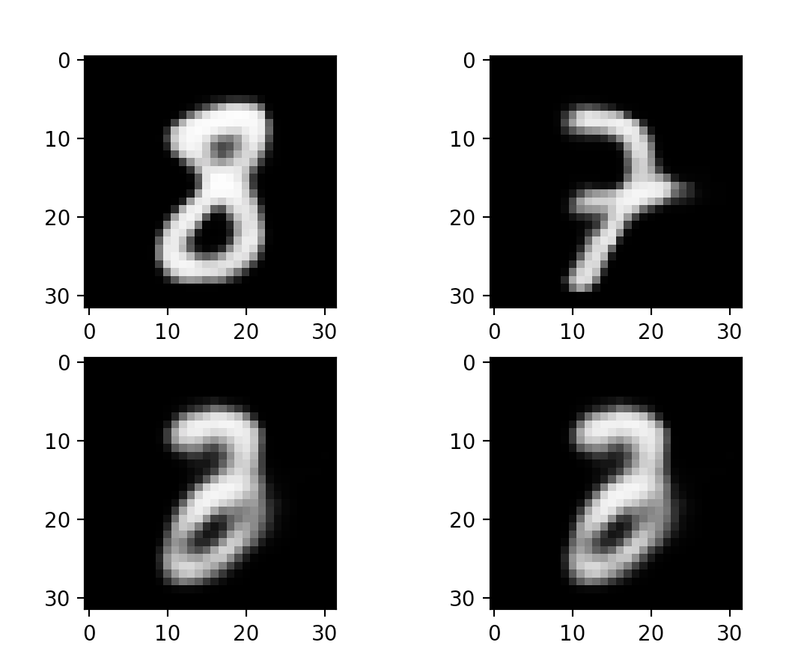

# Reconstruction
Currently I mainly worked on VAE generator. I have tried two kinds of VAE architecture using Conv form and linear form shown as follow:

- Linear form VAE

  Encoder

  ​      (0): Linear(in_features=1024, out_features=512, bias=True)

  ​      (1): ReLU(inplace)

  ​    (mu_): Linear(in_features=512, out_features=4, bias=True)

  ​    (sigma_): Linear(in_features=512, out_features=4, bias=True)

  Decoder

  ​      (0): Linear(in_features=4, out_features=512, bias=True)

  ​      (1): ReLU(inplace)

  ​      (2): Linear(in_features=512, out_features=1024, bias=True)

  ​      (3): Sigmoid()

- Conv form VAE
  Encode

  ​      (0): Conv2d(1, 64, kernel_size=(4, 4), stride=(2, 2), padding=(1, 1), bias=False)

  ​      (1): ReLU(inplace)

  ​      (2): BatchNorm2d(64, eps=1e-05, momentum=0.1, affine=True, track_running_stats=True)

  ​      (3): Conv2d(64, 128, kernel_size=(4, 4), stride=(2, 2), padding=(1, 1), bias=False)

  ​      (4): ReLU(inplace)

  ​      (5): BatchNorm2d(128, eps=1e-05, momentum=0.1, affine=True, track_running_stats=True)

  ​      (6): Conv2d(128, 256, kernel_size=(4, 4), stride=(2, 2), padding=(1, 1), bias=False)

  ​      (7): ReLU(inplace)

  ​      (8): BatchNorm2d(256, eps=1e-05, momentum=0.1, affine=True, track_running_stats=True)

  ​      (9): Conv2d(256, 128, kernel_size=(4, 4), stride=(2, 2), padding=(1, 1), bias=False)

  ​      (10): ReLU(inplace)

  ​      (11): BatchNorm2d(128, eps=1e-05, momentum=0.1, affine=True, track_running_stats=True)

  ​    )

  ​    (linear_mu): Linear(in_features=512, out_features=128, bias=True)

  ​    (sigma): Linear(in_features=512, out_features=128, bias=True)

  Decoder

  ​      (0): Linear(in_features=128, out_features=512, bias=True)

  ​      (1): ReLU()

  ​      (2): Linear(in_features=512, out_features=512, bias=True)

  ​      (3): ReLU()

  ​      (0): ConvTranspose2d(128, 256, kernel_size=(4, 4), stride=(2, 2), padding=(1, 1), bias=False)

  ​      (1): ReLU(inplace)

  ​      (2): BatchNorm2d(256, eps=1e-05, momentum=0.1, affine=True, track_running_stats=True)

  ​      (3): ConvTranspose2d(256, 128, kernel_size=(4, 4), stride=(2, 2), padding=(1, 1), bias=False)

  ​      (4): ReLU(inplace)

  ​      (5): BatchNorm2d(128, eps=1e-05, momentum=0.1, affine=True, track_running_stats=True)

  ​      (6): ConvTranspose2d(128, 64, kernel_size=(4, 4), stride=(2, 2), padding=(1, 1), bias=False)

  ​      (7): ReLU(inplace)

  ​      (8): BatchNorm2d(64, eps=1e-05, momentum=0.1, affine=True, track_running_stats=True)

  ​      (9): ConvTranspose2d(64, 1, kernel_size=(4, 4), stride=(2, 2), padding=(1, 1), bias=False)

  ​      (10): Sigmoid()

I've tried two kinds of loss funciton as said in the project, also I have tried VAE on two datasets, namely mnist & Stanford Dog.

Current Work & Problems

- Various hidden size result in different result. A low dimension hidden size can lead us visualize the effect of each dimension. For example, I fixed except 2 dimensions and let the two dimension vary. We can see that the number style varies.
  
- Conv VAE & Linear VAE works almost the same on mnist dataset, but on dog dataset we may see some difference.
- Problem : BCE Loss works very bad when dealing with dog dataset. But MSE works well both of the dataset. WHY? Cannot be set as Gaussian Distribution.
- As said by its mathmetical underground, the VAE can merge two styles of number or dog by a subtle combination. 
  
- TO BE CONTINUED
  GAN, pixelRNN and other generative model
  More experiments on explainable generative model