# Experiment Report for Project2 of CS385

**杨晨宇**

**561030910537**

**team members: 罗铨， 陈子轩，缪本杰**

## Overview

In this project，we mainly focused on the question: how does the task, structure, and training method influence the way the neural network looks at pictures?  To answer this, we trained neural networks in the **Classification**, **Reconstruction**, and **Segmentation** tasks, tried different network structures from the simple **linear** or **convolutional** networks, to well-known models like **resnet** and **vgg **, using different techniques like **VAE-GAN** in classification, **t-sne** , **grad-cam** in visualization, and **transfer learning** in classification.

I mainly take charge in visualization techniques like t-sne and grad-cam. In this project, I adapted these techniques onto all the three tasks, for example, coming up with **area-grad-cam** for reconstruction and segmentation by slightly changing the original "class-grad-cam".  

The following sections will be classification, reconstruction and segmentation, and in each of these section there will be the result for my explainary work. This report goes in this order because I'm familiar the classification part in this project the most, and the segmentation part the least.

## Classification

The classification experiments was carried out with the Stanford dog dataset. The Stanford dog dataset is a small data set consisting 120 different classes of dog pictures, and each of them consists about 150 -200 images. The main challenges for classification in this dataset lie **1)** in the small number of training data, which makes the model highly likely to over fit, **2)** in the subtle differences among the fine-grained image categorization, for example I cannot tell the difference between the Yorkshire Terrier  and  Silky Terrier.

I trained several models with this dataset. From the most naïve one to the one finetuned from resnet18, I try different tricks and techniques to alleviate the overfitting problem. 

Then I use grad cam and guided gradient descent to examine the difference between the models, and the difference among different epochs.

I use t-sne and PCA based on tensor board projector to study the difference in the way that neural networks perceive things.   

### Training models

#### First shot----simple convolution 

I wrote a simple four layer convolution neural network. And the training result can be shown in the following figure

> 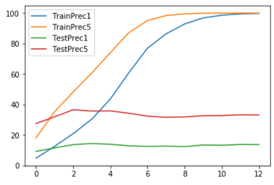
>
> The accuracy vs. epochs of the naïve bare CNN 

Where the X axis is the training epoch and the y axis is the accuracy. We can see from the plot that the model suffers from severe overfitting problem. 

#### Some Trick for robust ----dropout, batch normalization 

The first things I tried in face of the overfitting problem is using the well known tricks in the network structure. I added one batch normalization layer after each convolutional layers to force a normalized distribution, and one random dropout layer after that to make the neural network to learn more. But the result shows these methods are not that useful, as shown in the following figure.

> 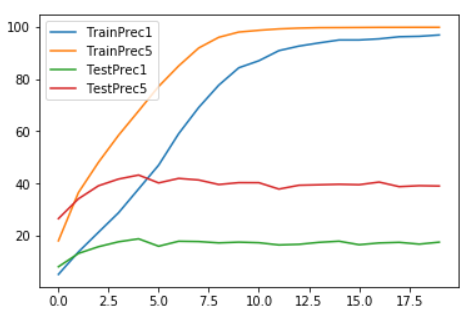
>
>  The accuracy vs. epochs of the CNN with BN and random dropout

#### Using Data Generation

Then I tried the data generation method for a robust model. I tried different combination of **random color jitter**, **Random Affine**, and **random resized crop**. The typical training result is shown in the following figure

> 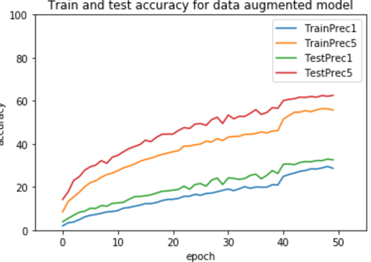
>
> The accuracy vs. epochs of the CNN with randomized data generation

From the figure we can find that although the training accuracy is much larger than the testing accuracy, the training and testing accuracy seem growing together, which means the data generation do have effect of slowing down the process of overfitting. 

More over, the slow learning curve might suggests the deficiency of the model's capability, I moved to transfer learning in the next step.

#### Transfer learning

I use a pretrained resnet18 model, replace its last fully connected layer, and finetune it to the new dataset. The learning curve is shown in the following figure.

> 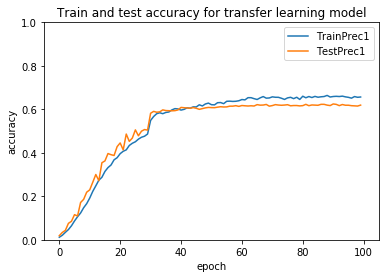
>
> The Learning curve for the transfer learning model

From the above figure we can see that the training accuracy and the testing accuracy keeps a similar value before the epoch 40, and later on the testing accuracy begin to fall behind the increase o the training accuracy. This transfer learning is robust from overfitting because we have frozen the previous convolution layers during training, thus keeping the network to respond to more general features rather than specific features.  We can see from the tsne analysis in the following section that the features extracted by resnet16 focus more on the characteristics of the main part, but not the back ground.

### Grad cam analysis

#### grad cam on different layers

The original paper for grad cam [^gradcam] suggests to use this technique on the last layer, under the assumption that the channels in the last layer is where the semantic information is extracted the most. To test this argument, I looked at the grad cam on different layers. below is one typical result.

> 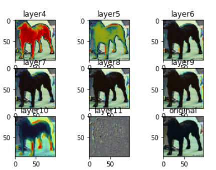
>
> The grad cam result on different layers, the model in this figure is little CNN trained with robust tricks.

We can see from the figure that the last convolution layer gives the most useful information about where the neural network is looking at. The first two layers have grads all over the dogs body, but that cannot mean the network focus on the dogs body the most. Grad cam is calculated as the global averaged gradients multiply with the local activation value. The features maps in the first two layers are very likely to be activated by local features and noises. So the best layer for looking grad-cam at is the last convolution layer.

#### The grad cam for different model

I examined the grad cam on every model I trained(the detailed grad cam result can be found in the appendix), and found the most difference comes from the result between resnet16 transferred model and the other models. 

> 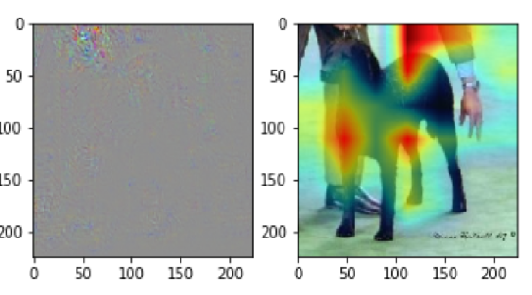 
>
> The grad cam result of transfer learning model, epoch 15.
>
> The left figure is the guided back propagation and the right one is grad cam

> 
>
> The grad cam result of original bare CNN(left) and the CNN with random dropout and batch normalization(middle) and the CNN trained with random data generator(right). All the models are collected at epoch 15, the figure at middle bottom part is the guided back propagation.

 From the figures we can see that the most robust model focus on the dogs body and face(observe the guided back propagation). However, all the other models focus on the dog's legs.

 

We can also get an understanding about the power of random dropout and data generator by looking at the grad cam. As the following figure shows, the bare model looks at some arbitrary features, for example the spray made by the dog. While the model trained with random dropout (dropping out cannels) prone to focus on more features all around the body, it still focus on the not-so-general feature like the white bottle. The model trained with data generator learns to focus on the features of the dog itself. 

This observation might be able to explain why the random dropped model alleviated the overfitting problem but still have huge gap between the train accuracy and the test accuracy, while the model trained with data generator can be more robust.

> 
>
> The grad cams for bare CNN(left),     CNN with robust tricks(middle), and CNN trained with data generator(right)

#### The grad cam at different epoch

We can look at how the neural networks' attention evolve with the training process. From the following figure, we can see that network learns to focus on the dog's face at epoch20.

> 
>
> The guided back propagation and grad-cam result for transferred learning model. 

But the process is not that smooth, the following figures gives an example about how the networks attention moves from right features to false ones.

> 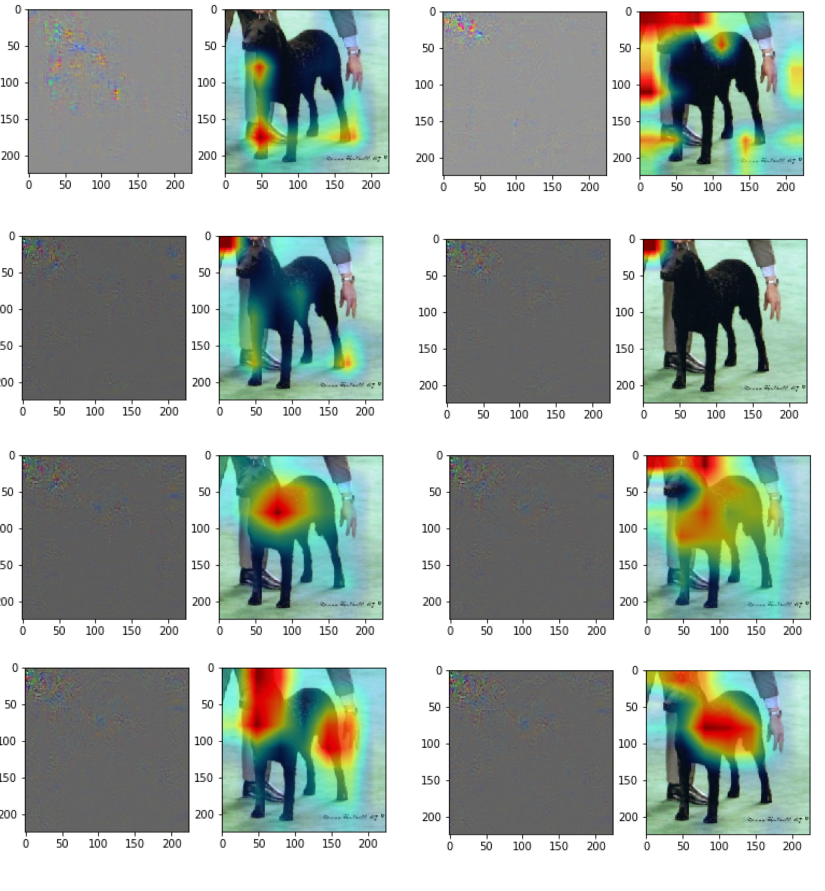The guided back propagation and grad-cam result for transferred learning model. 
>
> From top to bottom, from left to right are the grad cam result at epoch 10 to 80 

### T-sne and PCA analysis

I use the average global pooling result of the last convolution layer of neural networks as the feature vector, and use Tensorboard projector the embed them into 2D or 3D dimensions.

#### The T-sne for transferred model

> 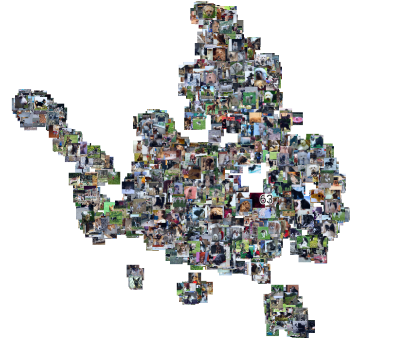
>
> The overall view of the 2D t-sne embedding of the dog images, using the average global pooing of the last convolutional layer as feature. Perplexity=20

The right bottom corner consists largely one kind of dog, zooming it larger gives the following figure 

> 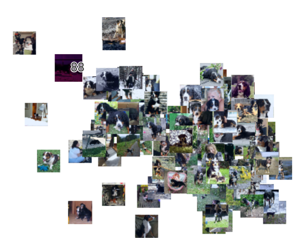
>
> The right bottom corner of the 2D t-sne embedding of the dog images, , we can see that it consists almost only one kind of dog  

We can also find that the pictures are clustered according to the appearances of the dogs, for example the black&white at right and the golden colored dogs at left are divided into  two clusters.

> 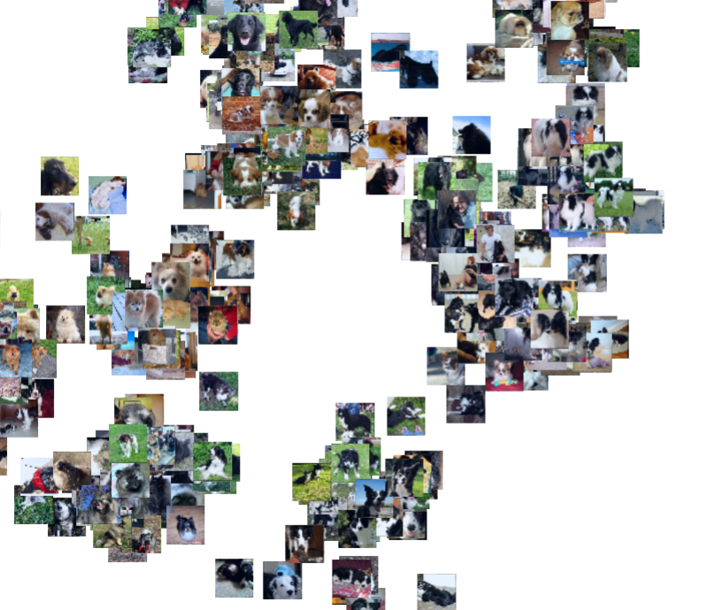
>
> One zoomed part of the 2D t-sne embedding of the dog images. We can see that the pictures are clustered according to the dog's appearances.

From the above observation, we can find that the pretrained resnet16 can extract the features in relation with the dogs themselves, rather than the over color theme or the background. That's why the pretrained model is better than the little model trained with only the dog dataset from scratch.

#### The PCA and t-sne of the little model

Below is the PCA embedding result of the image features from the little CNN. We can see from the the figure that the pictures are divided according whether the overall color is green or yellow, no matter what kind of dogs in it.

> 
>
> The overall view of the 3D PCA embedding of the dog images, using the average global pooing of the last convolutional layer as feature. The model is the model trained with data generator. 

Use t-sne embedding method on the same features and get the following figure. We can still find that the pictures are clustered according the overall color.

> 
>
> The overall view of the 3D t-sne embedding of the dog images, using the average global pooing of the last convolutional layer as feature. The model is the model trained with data generator. perplexity  = 20

That can explain the huge gap between the performance of the transferred model and the other model.

## Reconstruction

We carried out the reconstruction experiments on the dataset of **MNIST** and **stanford dogs**. In general The former can yield very similar images as the input image, while the later can be hardly reconstructed, no matter what structure we use, VAE or VAE-GAN. 

Thus, we foucsed on different perspectives on these datasets. on mnist dataset,  **1)** we played with the inputation and style mixing of VAE and tested the functionality of different kinds of model, CVAE and DVAE; **2)** we studied how can the traning method and network structure influence the interpretation of encoding; **3)** we looked at the embedding result of the z-dim encoding of different structures; 

On the standford dogs dataset, We tried different structures like VAE-GAN to generate detailed and similar pictures as the input picture. 

I adapted the grad cam for the classification to the reconstruction tast and comming up with **area grad cam**. The idea is to find the gradients of one area of the output picture, figuring out how the different parts of the input figure contribute to the output figure. I used the area grad cam on the above two tasks and found some interesting phenomenon.

### Reconstruction on MNIST

### Reconstruction on Stanford dogs

### Area Grad Cam

#### The Idea 

The basic idea of Area grad cam is similar to that of original grad cam [^gradcam]. That is, to collect the activation and gradient  in the forward pass and backward pass. These activation and gradients usually represents the of importance one feature to the output. However, as the original grad cam calculates the gradient of one dimention of the output, the Area grad cam calculates that of an area of output. The similar adaption also works for guided back gradients.

This method can be used to discover and explaine some phenomenon of the reconstruction tasks. However, note that **the assumption of original grad cam is slightly different in the reconstruction tasks**. The original grad cam assumes that the different channels of the last layer represents different semantic information, and use this semantic information globally. Thus, the idea of the original grad cam can be: to find the most important channel, and find where contributs this semantic information the most. However, the semantic information assumption may not hold when it comes to the reconstruction tasks. The classification uses only semantic information to decide the final outcome, while the reconstruction task has to deal with the local information no matter how the information is extracted. Thus, in reconstruction, the stroy becomes: find the most influensive channel (represented by the global average pool of the gradient), and find which part also has large values of this influensive channel. And that might be able to explain some whired observation in the comming sections.

#### Guidend back propagation on MNIST 

####                       - - - - local reconstruction needs global information

The picutre below is the area guided back propagation of the picutures on MNIST. We can see from the figures that the gradients of a local area(the black square in the right figure)  not only be intense at the corresponding area, but also have the form of the digit. As the guided back propagation means the area that contributes to the result, we can conclude that the model learned to reconstructe local pixles using global information. That is, the model learned different digits and use the overall digit information to reconstruct the figure.

> 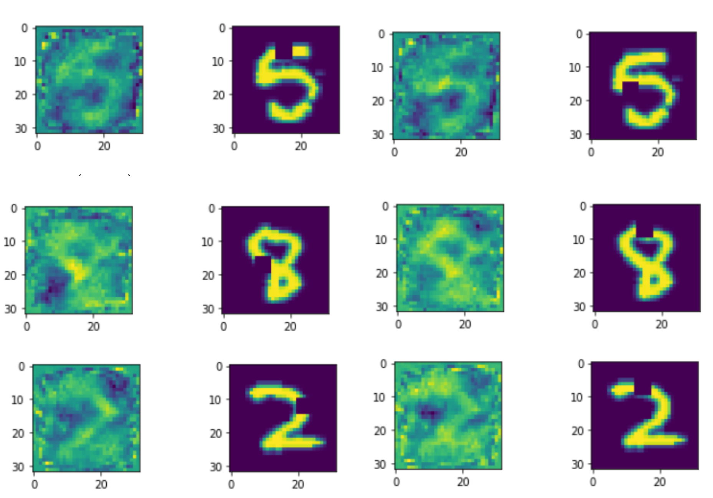
>
> The guided back propagation of an area in the output figure. In each group, the left figure is the guided back propagation. The brighter the pixel is the higher the corresponding value. The right figure is the input figure. The black squares in the right figures is where the  gradients from. 

#### Grad cam on VAE-GAN for Stanford dogs

####                      - - - - explain why VAE-GAN have not so good performance

I checked the area guided back propagation and the grad-cam result for VAE and VAE-GAN on stanford dogs dataset. The result for VAE is not that representable as that for VAE-GAN, so I put the result of VAE in the appendix, and introduce the result of that on VAE-GAN instead.

> 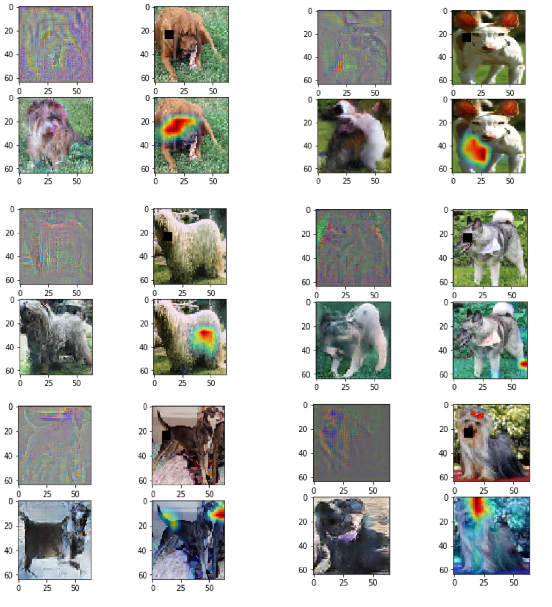
>
> The guided back propagation and Grad Cam for VAE-GAN. In each group, the figures from up to down, from left to right are :guided backpropagation, original picture with interested area, reconstruction graph, and the area grad cam. The model I use is the VAE-GAN grained in 200 epoch

We can see from the first two group of pictures that the guided back propagation and the grad cam generally find the right area. In the first group of picture, the guided back propagation result shows roughly a shape of the dog, and highlighted at the area corresponding to the interested area. The second group of pictures show some differencee between the interested position and the grad cam position, but in general its correlated.

From the third and fourth group of picutures, we can see that the guided back propagation finds the right corresponding position. For example, the area of the hairy dog needs information of all the hairs around the body, and the fourth group highlighted the corresponding head area. However, the grad cam result is generally unexplainable. This might be due the above discussion about the difference between grad-cam for classification and grad-cam for reconstruction. That is, the most influential channel for the interested area is also activated by other unrelated area.

The fifth and sixth of group of pictures shows the worest case, where the guided back propagation and the grad cam both failed to find the corresponding position.  The interested part of the fifth group pictures is at the dog's butt, but the network shows interests about the dogs head. The interested part of the sixth group pictures is the dog's mouth, while the grad cam highlights the dogs hair cut.

## Segmentation

[^gradcam]:Selvaraju, R. R., Cogswell, M., Das, A., Vedantam, R., Parikh, D., & Batra, D. (n.d.). Grad-CAM: Visual Explanations from Deep Networks via Gradient-based Localization. Retrieved from http://gradcam.cloudcv.org

# Appendix

## grad cam for different models

## area grad cam for VAE on dogs dataset

